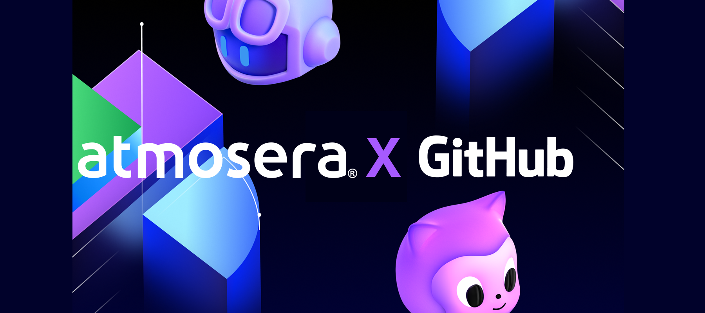

# Atmosera

<div align="center">

[](https://atmosera.com)

</div>

> A Professional & Managed Services Microsoft Partner delivering world-class DevOps, GitHub, and cloud solutions.

## 🌟 About Us

Atmosera is your trusted partner in digital transformation. For over 30 years, we've been:

- 🚀 Driving cloud innovation and operational excellence
- 🛡️ Minimizing security and compliance risks
- 💎 Optimizing financial performance
- 🤝 Building lasting partnerships through trust

Our extensive expertise spans AppDev, DevOps, Data, AI, and the Microsoft Azure platform, making us a leading transformation services provider for global clients.

## 🏆 Accolades

<div align="center">

[](https://atmosera.com)
#### GitHub Partner of the Year

</div>

<br>

<div align="center">
<table style="border: none; border-collapse: collapse;">
<tr style="border: none;">
<td align="center" style="border: none;">

[](https://www.atmosera.com/innovate/data-modernization/)
#### Data & AI

</td>
<td align="center" style="border: none;">

[](https://www.atmosera.com/innovate/devops/)
#### App Innovation

</td>
<td align="center" style="border: none;">

[](https://www.atmosera.com/protect/)
#### Security

</td>
</tr>
</table>
</div>

## 💼 Our Services

<table>
<tr>
<td width="50%">

### Cloud & Architecture
- Cloud Strategy & Roadmaps
- Architecture Design
- Cost Optimization
- Governance & Compliance

</td>
<td width="50%">

### Platform Engineering
- Developer Experience Platforms
- Infrastructure as Code
- Microservices Architecture
- CI/CD Implementation

</td>
</tr>
<tr>
<td width="50%">

### Training & Enablement
- Microsoft Azure Training
- GitHub Enterprise Training
- DevOps Workshops
- Custom Learning Paths

</td>
<td width="50%">

### Managed Services
- 24×7 Azure Monitoring
- Incident Response
- Security Operations
- Continuous Optimization

</td>
</tr>
</table>

## 🛠️ Technical Expertise Highlights

<table>
<tr>
<td width="33%">

### Cloud & Infrastructure


 / 

</td>
<td width="33%">

### DevOps & Automation

 / 
 / 

</td>
<td width="33%">

### Monitoring & Security


</td>
</tr>
</table>

## 🚀 Get Started

```bash
# Clone the repository you're interested in
git clone https://github.com/Atmosera/<repository-name>

# Navigate to the project
cd <repository-name>

# Follow the repository's specific setup instructions
```

## 📫 Contact Us

<div align="center">
<p align="center" style="display: flex; justify-content: center; gap: 20px;">
  
[](https://atmosera.com)
[](https://atmosera.com/contact/)
[](https://www.linkedin.com/company/atmosera)

</p>
</div>

---

<div align="center">

### Ready to transform your cloud journey? [Let's talk!](https://www.atmosera.com/contact-us/)

</div>

